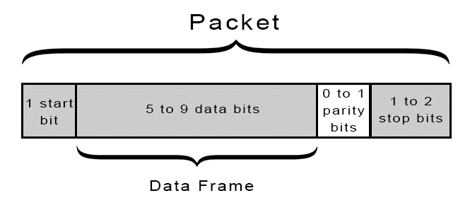

# UART Driver with Baremetal C

## Requirements

### Arduino

We will use **Arduino UNO** (ATmega328P) and **FTDI USB to TTL Serial Converter** (FTDI FT232RL)

> FTDI is **not necessary**, it's for testing output.

### Installation

We need to install library, compiler, binary to hex converter, and AVR MCU programmer

These applications can be install by following line:

```bash
sudo apt install avr-libc avrdude binutils-avr gcc-avr
```

> **Note !** \
The installation may change depends on your systems or distrubitions.


## What is UART

A universal asynchronous receiver-transmitter (UART) is a peripheral device for **asynchronous serial communication**.

It was one of the **earliest** computer communication devices, also an early hardware system for the Internet.

UARTs transmit data asynchronously, which means there is **no clock signal**. Instead of a clock signal, the transmitting UART adds **start** and **stop** bits to the data packet being transferred. These bits define the beginning and end of the data packet so the receiving UART knows when to start reading the bits.

When the receiving UART detects a start bit, it starts to read the incoming bits at a specific frequency known as the **baud rate**, Baud rate is a measure of the speed of data transfer, expressed in bits per second (bps).
Both UARTs must operate at about the same baud rate. The baud rate between the transmitting and receiving UARTs can only differ by about 10% before the timing of bits gets too far off.

Both UARTs also must be configured to transmit and receive the same data packet structure.


### How UART Works

The UART that is going to transmit data receives the data from a **data bus**. The data bus is used to send data to the UART by another device like a CPU, memory, or microcontroller.

UART transmitted data is organized into **packets**. Each packet contains 1 start bit, 5 to 9 data bits (depending on the UART), an optional parity bit, and 1 or 2 stop bits:





After basics of UART, let's learn how UART works on Arduino.

<br>

## Pinouts

To get output and send input we need to focus on **TX** (PD-1) and **RX** (PD-0) which these are data bus for communications.


## Registers

To set-up UART on ATmega328P we need to configure some registers.


### UCSRnC Register


To set operation mode and frame format


----

### UCSRnB Register

To enable transmitting and receiving


----

### UBRRnL/H Register

To set baudrate


----

### UBRR Calculation


To calculate ubrr value


----

### UCSRnA Register

To control status of UART 


----

### UDRn Register

To write/read data from UART


----

## Flashing

We can use **Makefile** to flash Arduino.

To run we can use following line:

```bash
make flash
```

## Testing

To testing our UART driver we can use USB to TTL converter.

### Cable Connections


- **GND**: Connect it with ground pin of Arduino UNO
- **VCC**: Connect it with VCC pin
- **TxD**: Connect it with RX pin of Arduino UNO
- **RxD**: Connect it with TX pin of Arduino UNO

> **Note !** \
The cable connections may change depends on your converter. \
Other 2 pins is not necessary right now.


### Connect FTDI

To connect FTDI, run below code:

```bash
screen /dev/ttyUSB1 38400
```

Now you can see the outputs.

